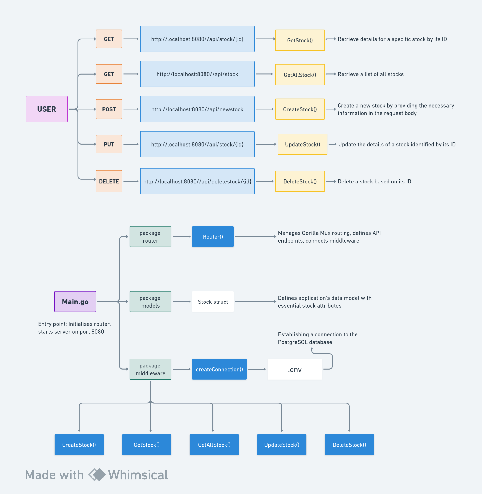

# CRUD-API-Using-Gorilla-Mux


This project is a simple CRUD API implementation using the Go programming language, the Gorilla Mux router, and PostgreSQL as the database. The purpose of this API is to manage and manipulate stock-related data, providing endpoints for creating, reading, updating, and deleting stock information.
## Project Overview Through a Diagram


## Project Structure

The project is structured as follows:

- **`main.go`**: Serves as the entry point for the application. It initializes the router and starts the server on port 8080.

- **`router/router.go`**: Manages routing using the Gorilla Mux library. Defines API endpoints and connects them to corresponding middleware functions.

- **`models/models.go`**: Contains the data model definition for the application. The `Stock` structure represents the essential attributes of a stock, such as ID, name, price, and company.

- **`middleware/handlers.go`**: Houses middleware functions responsible for handling CRUD operations, establishing a connection to the PostgreSQL database, and processing HTTP requests. These functions are linked to specific API endpoints in the router.

## Dependencies

- [Gorilla Mux](https://github.com/gorilla/mux): A powerful URL router and dispatcher for Go, facilitating the creation of robust APIs.

- [godotenv](https://github.com/joho/godotenv): A Go implementation of the dotenv pattern, allowing the application to read environment variables from a `.env` file.

- [pq](https://github.com/lib/pq): A pure Go PostgreSQL driver for the `database/sql` package, enabling seamless communication with a PostgreSQL database.

## Getting Started

1. **Install Go:**
   Ensure that Go is installed on your machine. If not, follow the installation instructions at [https://golang.org/doc/install](https://golang.org/doc/install).

2. **Clone the Repository:**
   Clone this repository to your local machine:

    ```bash
    git clone https://github.com/panchanandevops/CRUD-API-Using-Gorilla-Mux.git
    ```

3. **Install Dependencies:**
   Run the following command to install project dependencies:

    ```bash
    go mod init crud-api
    go mod tidy
    ```

4. **Set Up PostgreSQL:**
   Create a PostgreSQL database and update the `.env` file with the appropriate `POSTGRES_URL` connection string.

5. **Run the Application:**
   Start the API server by running:

    ```bash
    go run main.go
    ```

6. **Access the API:**
   The API will be accessible at [http://localhost:8080](http://localhost:8080). You can interact with the defined endpoints using your preferred API testing tool.

## API Endpoints

The API provides the following endpoints for managing stock information:

- **GET /api/stock/{id}**: Retrieve details for a specific stock by its ID.

- **GET /api/stock**: Retrieve a list of all stocks.

- **POST /api/newstock**: Create a new stock by providing the necessary information in the request body.

- **PUT /api/stock/{id}**: Update the details of a stock identified by its ID.

- **DELETE /api/deletestock/{id}**: Delete a stock based on its ID.
